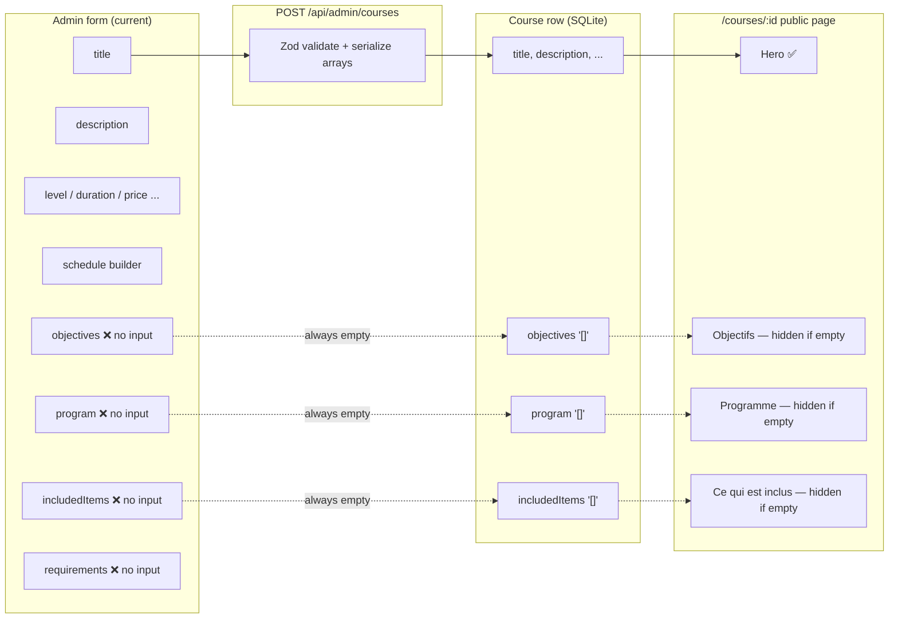
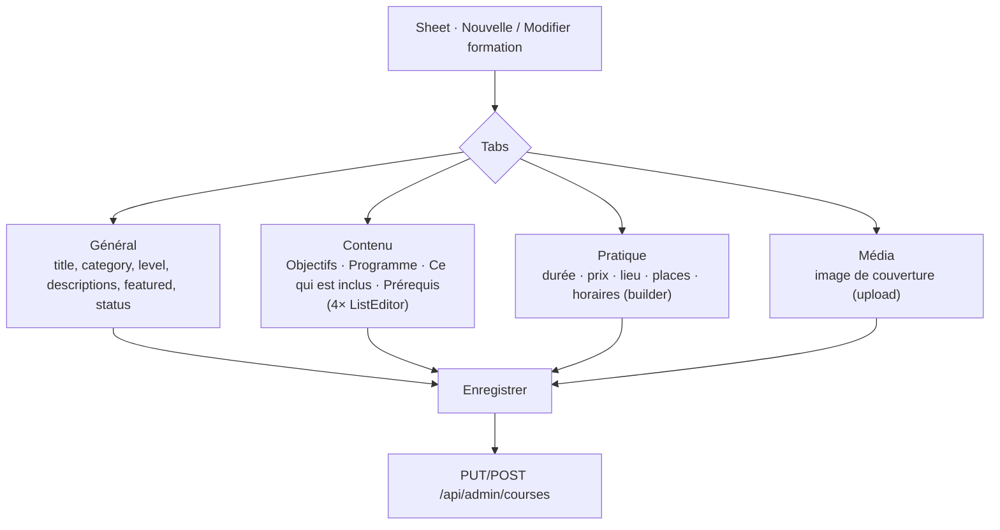
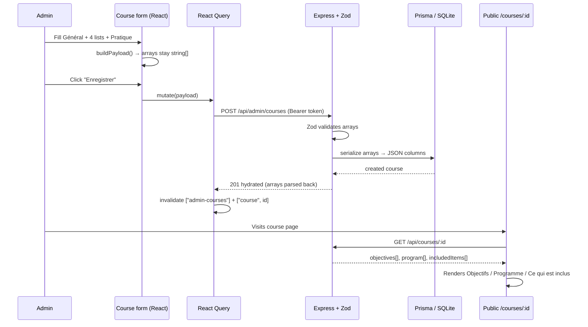

# Course Editor — Plan & Suggestions

## 1. The problem

The public **course detail page** (`/courses/$id`) renders several rich sections:

| Detail page section | Source field | Type | In the current admin form? |
|---|---|---|---|
| Hero title | `title` | text | ✅ yes |
| Category eyebrow | `categoryId` → category name | relation | ✅ yes |
| Hero paragraph | `description` | long text | ✅ yes |
| **Objectifs** (bullet list) | `objectives` | **string[]** | ❌ **missing** |
| **Programme** (numbered steps) | `program` | **string[]** | ❌ **missing** |
| **Ce qui est inclus** | `includedItems` | **string[]** | ❌ **missing** |
| (Prérequis — not yet shown) | `requirements` | **string[]** | ❌ **missing** |
| Sidebar · Durée | `duration` | text | ✅ yes |
| Sidebar · Horaires | `schedule` | JSON slots | ✅ yes (builder) |
| Sidebar · Lieu | `location` | text | ✅ yes |
| Sidebar · Places | `availablePlaces` | number | ✅ yes |
| Sidebar · Niveau | `level` | text | ✅ yes |
| Sidebar · Prix | `price` | text | ✅ yes |

**The gap:** the four list fields (`objectives`, `program`, `includedItems`, `requirements`) exist in the database and the API, and the form even holds them in state as empty arrays — but there are **no UI inputs** to fill them. So a course created through the form always renders with those sections hidden (they only display when `length > 0`). The "Néerlandais" page looks complete only because it was seeded with data.



---

## 2. The solution: a reusable **List Editor** + a sectioned course form

### 2.1 `ListEditor` component

A small controlled component that edits a `string[]`: add a row, edit inline, remove, and drag/reorder. Used four times (objectives, program, included, requirements).

```
Objectifs                                   [+ Ajouter]
┌──────────────────────────────────────────────┐
│ ⠿  Acquérir les bases du néerlandais      ✎  ✕ │
│ ⠿  Améliorer la communication             ✎  ✕ │
│ ⠿  Faciliter l'intégration internationale ✎  ✕ │
└──────────────────────────────────────────────┘
```

- `⠿` drag handle → reorder (sets `sortOrder` implicitly by array position)
- inline text input per row
- `✕` removes the row
- "Ajouter" appends an empty row focused for typing

### 2.2 Reorganize the form into tabbed / grouped sections

The form is getting long. Group it inside the existing slide-out `Sheet` using **tabs** so it maps 1:1 to the public page:



### 2.3 What the data flow looks like end-to-end



---

## 3. Implementation steps

1. **`src/components/list-editor.tsx`** — new `ListEditor({ label, value, onChange, placeholder })` component. Reorder via HTML5 drag or up/down buttons (simplest, no new dependency).
2. **`src/routes/admin/courses.tsx`** — inside the Sheet, wrap the fields in `Tabs` (the shadcn `tabs.tsx` already exists in `components/ui`). Add a **Contenu** tab with four `ListEditor`s bound to `form.objectives`, `form.program`, `form.includedItems`, `form.requirements`.
3. **`buildPayload()`** — already spreads these arrays; no backend change needed. The API already validates arrays (Zod) and serializes them (`serializeArr`).
4. **Public page** — optionally add a **Prérequis** section so `requirements` is visible (currently it is stored but never rendered).
5. **(Optional) Média tab** — reuse the existing `POST /api/uploads` endpoint to set `coverImage`; render it in the hero.

No schema or endpoint changes are required — the backend already supports all four arrays. This is purely a **frontend form** enhancement.

---

## 4. Nice-to-haves (later)

- **Live preview** pane inside the Sheet that renders the detail-page layout as you type.
- **Rich text** for `description` (bold, lists) instead of a plain textarea.
- **Duplicate course** action to clone an existing one as a starting point.
- **Reorderable images gallery** (the `CourseImage` model already exists in Prisma).
- **Validation hints**: warn when Objectifs/Programme are empty so admins don't publish thin pages.

---

## 5. Effort

| Task | Estimate |
|---|---|
| `ListEditor` component | ~1h |
| Tabs + wire 4 lists into form | ~1h |
| Prérequis section on public page | ~15min |
| (Optional) cover image upload | ~1h |
| (Optional) live preview | ~2h |

**Core fix (lists editable → detail page produced): ~2 hours.**
